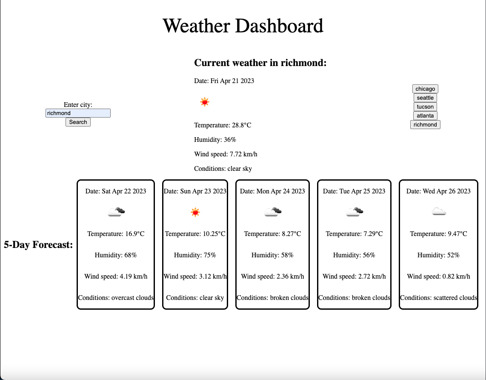
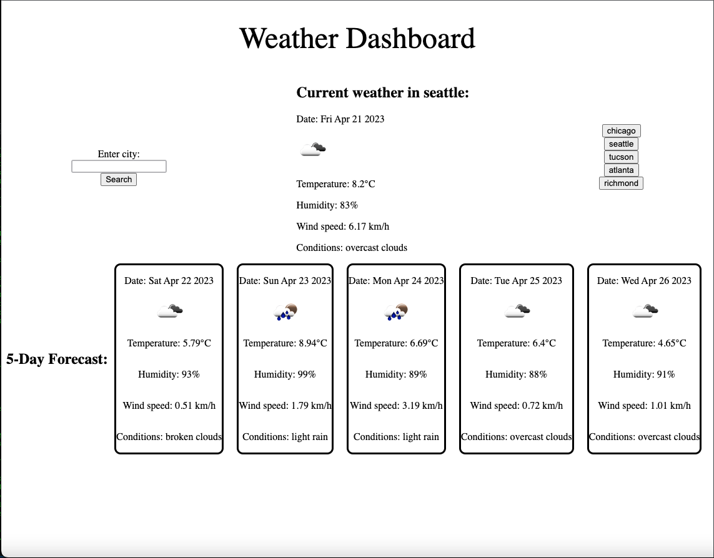

# weather-app

## Description

The purpose of this project is to have the ability to search current and forecast weather conditions for a city and all cities in the users search history.

## Table of Contents

- [Installation](#installation)
- [Usage](#usage)
- [License](#license)

## Installation

[Click here to use the weather app!](https://www.example.com/)

## Usage

[Go to this link.](https://jannorth.github.io/weather-app/) Enter a city to search for current weather.

Each city search will save on the right hand side for future access. Click on a saved city to revisit those current weather conditions.

https://jannorth.github.io/weather-app/
